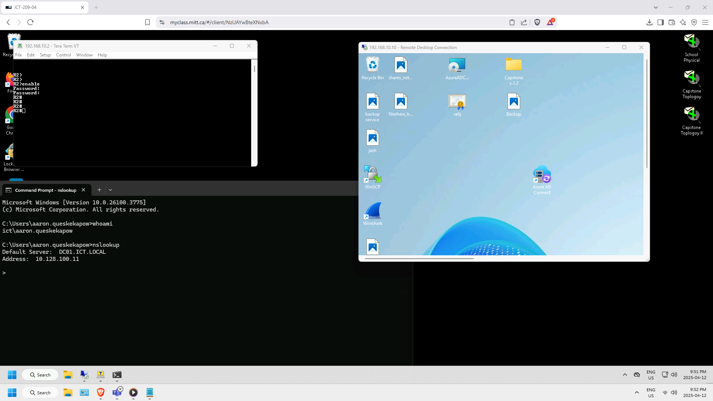

# SSH Remote Access to Routers and Switches

## Overview
This document explains how SSH access is configured on all routers and switches in the RAHJ.local network. It also details how the administrator (Aaron Queskekapow) securely manages the infrastructure **from the IT Management PC**, which is the **only workstation allowed to access core infrastructure such as servers and network devices**.



## SSH Configuration on All Cisco Devices

All routers (R1, R2) and switches (S1–S4) have been configured for secure SSH access.

## Access Point: IT Management PC

The IT Management PC (IP: `192.168.20.50`) is:
- The **only authorized device** that can SSH into any router or switch.
- The **only host allowed to access the Servers VLAN (VLAN 10)** through strict ACLs.
- Located in the **IT VLAN (VLAN 20)**, with static IP and firewall access.

All remote administration is performed through this secure machine — no other PC on the network has SSH access or visibility to the routers, switches, or server infrastructure.

## Remote SSH via myclass.mitt.ca
When off-site, the admin(Aaron) can:  
1. Remote into the IT PC using `myclass.mitt.ca`
2. From the IT PC, SSH into any router, switch or server on the RAHJ.local domain:
   ```bash
   ssh admin@192.168.x.x
   ```

This setup keeps the SSH session inside the local network, eliminating public exposure while maintaining remote flexibility.

## Security Measures

This SSH setup follows enterprise-level security best practices:

| Security Measure                      | Purpose                                                 |
|---------------------------------------|---------------------------------------------------------|
| SSH Version 2                         | Secure encrypted access                                 |
| Strong enable/user secrets            | Prevents credential-based attacks                       |
| `login local` and `transport ssh`     | Blocks Telnet/insecure protocols                        |
| Limited VTY lines                     | Reduces remote attack vectors                           |
| No HTTP/HTTPS services (`no ip http`) | Decreases surface area                                  |
| IT PC ACLs (permit only IT → Servers) | VLAN-based access control prevents lateral movement     |
| Static IP for IT PC                   | Ensures predictable access control                      |

> **No device outside VLAN 20 (IT) can SSH into network infrastructure or servers.**

## Tested & Verified
- SSH confirmed working from IT PC to all routers/switches
- Remote access validated via `myclass.mitt.ca` to IT PC, then to internal devices
- Network ACLs confirmed to block all unauthorized traffic

## Future Improvements
- Use SSH key pairs instead of passwords
- Add ACLs to explicitly restrict SSH to IT PC IP
- Enable logging of login attempts for auditing
