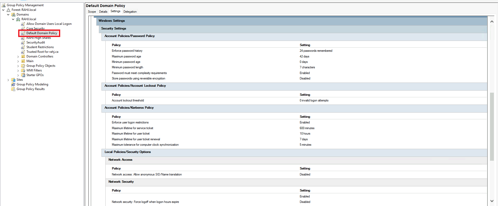
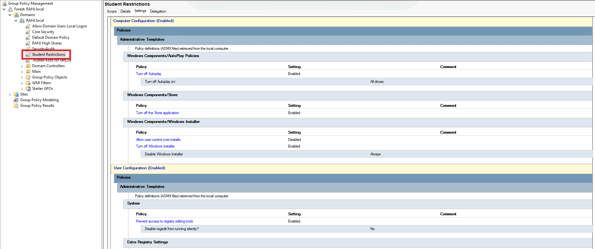
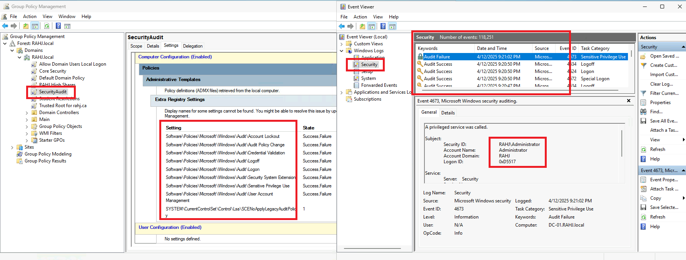
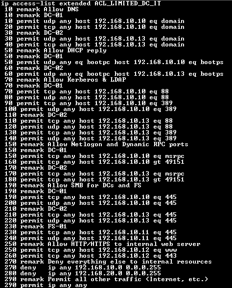
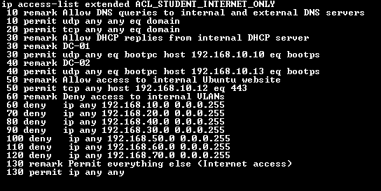

# Security Hardening Documentation
**Author:** Aaron Queskekapow  
**Project:** MITT NSA630 Capstone – Final Infrastructure Security Summary  
**Domain:** RAHJ.local  
**Last Updated:** 2025-04-12  
**Version:** 1.0  

## Overview
This document summarizes all security hardening strategies applied across switches, routers, end devices, and domain infrastructure. These measures support confidentiality, integrity, and availability throughout the RAHJ High School network.

## Router Hardening
Routers R1 and R2 were secured using Cisco best practices. Configurations include:

- **Enable Secret Password** using encrypted `enable secret`
- **Console and VTY access passwords**
- **No unused services** (`no ip http server`, `no ip domain-lookup`)
- **Login banners** to discourage unauthorized access
- **Login blocking** after failed attempts
- **SSH-only access** (`transport input ssh`)
- **Timeouts and session control**

## Switch Hardening
Each access and distribution switch (S1–S4) was hardened using the following measures:

- **Port security** on access ports (`switchport port-security`)
- **Unused ports disabled**
- **MAC address sticky** limiting devices per port
- **BPDU Guard** on edge ports
- **SSH enabled** and HTTP disabled
- **Banner and VTY protection**

## Securing Protocols
To ensure secure communication between network devices and management stations:

- **SSH used exclusively** for remote access(IT PC Only)
- **SNMP disabled** (not in use)
- **HTTPS disabled**, HTTP server turned off
- **ACLs** applied to restrict traffic at Layer 3

## End Device Hardening
Domain-joined devices (e.g., PCs, FS-01, and web server) were secured with:

- **Strong password policies** via Group Policy
- **USB and AutoPlay disabled**
- **Windows Store and Control Panel blocked**
- **UAC (User Account Control)** enabled
- **Limited local administrator access**
- **NTFS permissions on shared folders**
- **Drive mapping via GPO** (read-only access to shares)

## Monitoring and Scanning
Monitoring is handled internally via Windows Security Auditing:

- **GPO – SecurityAudit** applied to all domain PCs
- Audits include:
  - Logon attempts (Success/Failure)
  - File access
  - Group membership changes
- **Event Viewer used** for reviewing logs
- **Syslog/SNMP not in use**, but was planned for future

## VLAN & ACL Enforcement
Segmentation is enforced through VLANs and inbound router ACLs:

- **ACL_STUDENT_INTERNET_ONLY**:
  - Allows DNS, DHCP, Web
  - Blocks all access to internal VLANs
  - Allows full Internet access

- **ACL_LIMITED_DC_IT**:
  - Allows AD, DNS, DHCP, LDAP, RPC, SMB, HTTPS
  - Denies unnecessary cross-VLAN access
  - Allows Internet access

## Summary for Security Hardening

| Category               | Implementation Highlights                            |
|------------------------|------------------------------------------------------|
| **Switch Hardening**   | BPDU Guard, port security, banners, STP control      |
| **Router Hardening**   | SSH, login blocking, banners, no HTTP, enable secret |
| **Securing Protocols** | SSH only, ACLs, no SNMP or HTTP                      |
| **End Devices**        | GPO restrictions, strong passwords, no USB, auditing |
| **Monitor & Scan**     | SecurityAudit GPO, Event Viewer review               |

