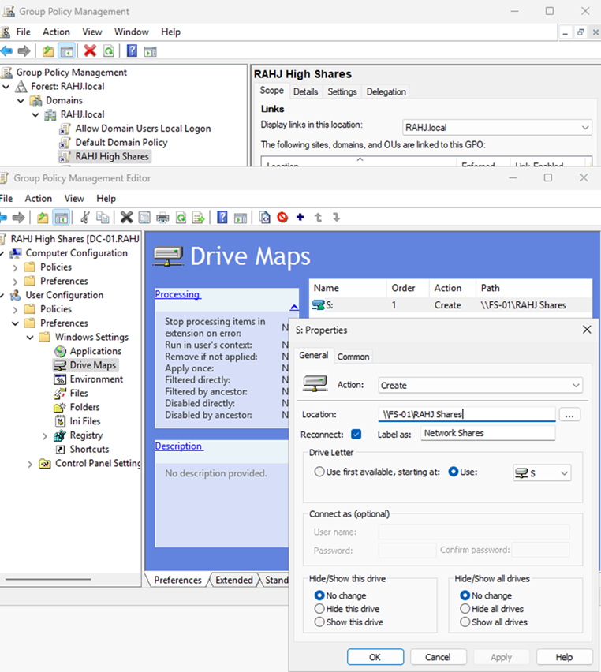
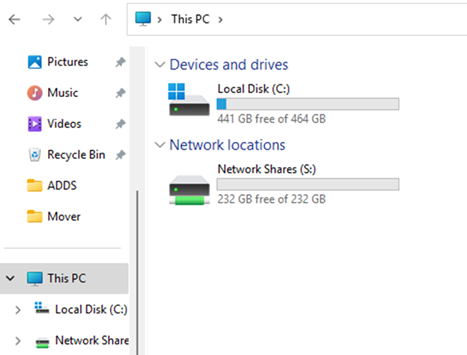
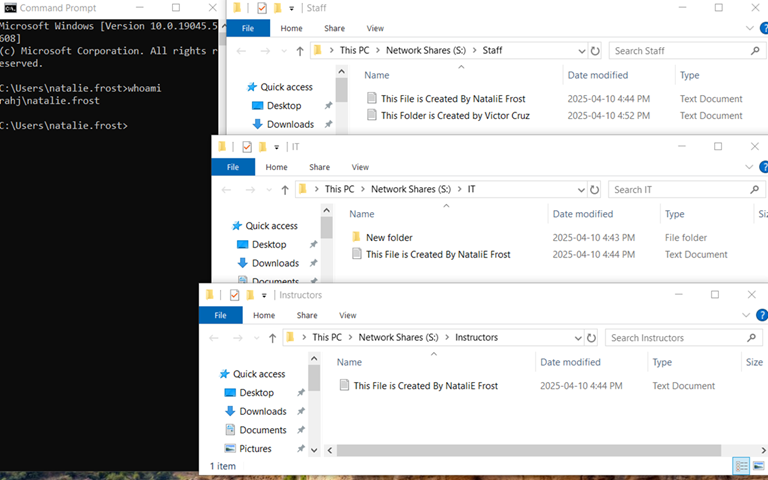
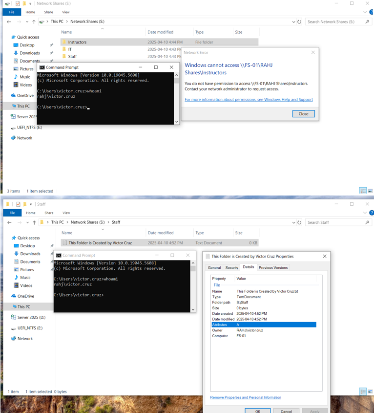

# Active Directory

**Domain:** RAHJ.local  
**Author:** Hapreet  
**Date Created:** 2025-04-09  
**Last Updated:** 2025-04-11  
**Version:** 1.1  

---

## AD Hierarchy Overview

```
RAHJ.local
└── Main
    ├── Users
    │   ├── Students
    │   ├── Instructors
    │   ├── Staff
    │   └── IT
    └── Groups
        └── FileAccess
```

### Why This Hierarchy?
The AD structure separates user accounts into departmental containers (`Students`, `Instructors`, `Staff`, and `IT`) for easier group policy management and delegation. A dedicated `Groups` OU was created to house all security groups related to file access, making permission auditing and assignment more streamlined.

The `FileAccess` OU contains role-based security groups (`IT-SecG`, `Staff-SecG`, and `Instructors-SecG`) to simplify folder access control across departments.

We used only one set of file access groups to reduce complexity, making permission management scalable and centralized. These groups were then used in ACLs to apply NTFS permissions for the shared folders.

---

## Active Directory Organizational Structure Screenshots

### File Access Security Groups  


### Instructors OU  


### IT OU  


### Staff OU  


### Students OU  


---

# Shared Folder Directory and Permissions Configuration

## 1. Purpose
This document outlines the configuration and deployment of shared folders within the RAHJ.local domain. It includes folder structure, security group assignments, permission configurations, and Group Policy Object (GPO) setup to map network drives for users.

---

## 2. Scope
This document is intended for system administrators and IT staff responsible for managing shared folder access, NTFS permissions, and drive mapping through Group Policy in the RAHJ.local domain.

---

## 3. Assumptions
- The domain `RAHJ.local` is fully configured and functional
- `FS-01` is a domain-joined file server
- Users are authenticated via Active Directory

---

## 4. Folder Structure and Sharing
Under the shared path `RAHJ Shares`, three departmental folders were created:
- IT
- Staff
- Instructors

These folders were shared using the network path `\\FS-01\RAHJ Shares` and mapped to drive letter `S:` on user machines.

---

## 5. Security Group Configuration
An Organizational Unit (OU) named `FileAccess` was created under the `Groups` OU in Active Directory Domain Services (AD DS).

Within the `FileAccess` OU, the following security groups were created:
- `IT-SecG`
- `Staff-SecG`
- `Instructors-SecG`

Each group contains users specific to their department.

`IT-SecG` has Full Control on all folders as they are the IT Administrators of the domain.

---

## 6. Permission Configuration
The **Special** permission:
- Restricts users from deleting others' files
- Prevents unauthorized changes to permissions
- Disallows users from taking ownership of other users' files

### Permission Table

| Folder        | Owner     | Permission Entities | Permissions       |
|---------------|-----------|---------------------|-------------------|
| RAHJ Shares   | IT-SecG   | SYSTEM              | Full Control      |
|               |           | IT-SecG             | Full Control      |
|               |           | Staff-SecG          | Read & Execute    |
|               |           | Instructors-SecG    | Read & Execute    |
| IT            | IT-SecG   | SYSTEM              | Full Control      |
|               |           | IT-SecG             | Special           |
| Staff         | IT-SecG   | SYSTEM              | Full Control      |
|               |           | IT-SecG             | Full Control      |
|               |           | Staff-SecG          | Special           |
| Instructors   | IT-SecG   | SYSTEM              | Full Control      |
|               |           | IT-SecG             | Full Control      |
|               |           | Instructors-SecG    | Special           |

---

## 7. Group Policy Object (GPO) - Network Drive Mapping



A GPO was created to automate the mapping of the shared folder to all domain users.

### Steps:
1. Open **Server Manager** > **Tools** > **Group Policy Management**
2. Right-click on `RAHJ.local` domain and select **Create a GPO in this domain, and Link it here**
3. Name the GPO (e.g., `RAHJ_SharedDrive`)
4. Right-click the newly created GPO and choose **Edit**
5. Navigate to: `User Configuration > Preferences > Windows Settings > Drive Maps`
6. In the right pane, create a **New Mapped Drive**:
   - **Action**: Create  
   - **Location**: `\\FS-01\RAHJ Shares`  
   - **Reconnect**: Enabled  
   - **Label as**: Network Shares  
   - **Drive Letter**: S:
7. Click OK to apply the settings

---

## 8. Verification
- Confirm that the `S:` drive appears on user computers
  
  

- Ensure access is aligned with security group permissions
  

  

  

  

- Verify that unauthorized actions (e.g., deleting or modifying others' files) are restricted

  

  

---

## 9. Troubleshooting Tips
- If the drive doesn’t appear, run `gpupdate /force` and log off/on
- Ensure firewall on `FS-01` allows SMB file sharing
- If you’ve configured ACLs on any routers in your network, verify that SMB (port 445) isn’t being blocked — otherwise, file sharing may fail.
- Confirm the GPO is linked and applied to the correct user group or OU

---

## 10. Backup Recommendations
- Backup folder structure and NTFS permissions regularly
- Store backup documentation in a secure, access-controlled location (GitHub)

---

## 11. Change Log

| Version | Date       | Description                                           | Author             |
|---------|------------|-------------------------------------------------------|--------------------|
| 1.0     | 2025-04-03 | Initial configuration                                 | Aaron Queskekapow  |
| 1.1     | 2025-04-05 | Added Special permission explanation and enhancements | Aaron Queskekapow  |

---

**End of Document**
