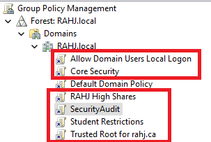

# Active Directory – Group Policy Object (GPO) Documentation

**Domain:** RAHJ.local  
**Author:** Aaron
**Date Created:** 2025-04-09  
**Last Updated:** 2025-04-11  
**Version:** 1.1  

## Change Log

| Version | Date       | Author   | Description                                  |
|---------|------------|----------|----------------------------------------------|
| 1.0     | 2025-04-09 | Aaron  | Initial creation of GPO documentation        |
| 1.1     | 2025-04-11 | Aaron    | Added SecurityAudit scope and filtering info |

## GPO: Allow Domain Users Local Logon

**Purpose:**  
Allows domain users to log on locally to authorized systems such as lab or classroom PCs.

**Justification:**  
By default, certain systems restrict local logon access to administrators. This policy ensures authenticated students and staff can sign in using their domain credentials, enabling regular use of domain-joined computers.

**Scope:**  
Applied to OUs or systems requiring user access (e.g., lab, classroom, office PCs).

## GPO: RAHJ High Shares

**Purpose:**  
Automatically maps shared network folders and drives for domain users.

**Justification:**  
Improves accessibility to shared files (e.g., departmental resources) and reduces helpdesk workload by automating network drive mappings.

**Scope:**  
Linked at domain or user-specific OU level.

## GPO: Core Security Policy

**Purpose:**  
Enforces domain-wide password policies and account lockout thresholds. Also configures event log maximum sizes for audit retention.

**Justification:**  
Prevents use of weak passwords and protects against brute-force attacks. Expanded log sizes ensure that important events are retained for auditing and compliance.

**Key Settings:**
- Password History: 24 passwords remembered
- Minimum Password Length: 12 characters
- Maximum Password Age: 42 days
- Lockout Threshold: 5 invalid attempts
- Lockout Duration: 15 minutes
- Log Sizes:
  - Security: 128MB
  - Application: 64MB
  - System: 64MB

**Scope:**  
Applied at the domain level (`RAHJ.local`).

## GPO: SecurityAudit

**Purpose:**  
Implements granular auditing of critical security-related events across the domain.

**Justification:**  
Enables tracking of key events such as user logon attempts, account changes, and security policy modifications, providing visibility for security investigations and ensuring compliance.

**Audit Categories Enabled:**
- Logon / Logoff
- Account Lockout
- Credential Validation
- User Account Management
- Sensitive Privilege Use
- Audit Policy Change
- Security System Extension

**Additional Configuration:**
- Enables subcategory audit enforcement (`SCENoApplyLegacyAuditPolicy = 1`)

**Scope:**  
Linked to both:
- `RAHJ.local` (Domain)
- `Users` OU

**Security Filtering:**  
Applies only to **Authenticated Users**

**How to Access Logs:**  
Audit events can be viewed using the **Event Viewer** on any domain-joined machine or centralized logging system:
1. Open **Event Viewer** (`eventvwr.msc`)
2. Navigate to: `Windows Logs > Security`
3. Filter by Event IDs for specific audit categories (e.g., 4624 for successful logon, 4625 for failed logon)

For advanced filtering and correlation, tools like **Windows Event Forwarding**, **SIEM**, or **PowerShell** can be used.

## GPO: Student Restrictions

**Purpose:**  
Limits student users' ability to modify or compromise system configurations.

**Justification:**  
Students must operate within a controlled environment to prevent unauthorized software installation, USB autorun exploitation, or registry tampering.

**Key Restrictions:**
- Disable Windows Installer: Always block `.msi` installs
- Prohibit User Installs: Prevent software installs via user context
- Disable Registry Editor: Restrict registry access
- Prevent File Association Changes: Prevent spoofing/malware evasion
- Turn Off AutoPlay: Block USB auto-run features
- Disable Microsoft Store: Block access to Microsoft Store apps

**Scope:**  
Linked to `Students` OU filtering for student accounts only.

## GPO: Trusted Root for rahj.ca

**Purpose:**  
Deploys the internal certificate authority (CA) for `rahj.ca` as a trusted root on all domain-joined systems.

**Justification:**  
Prevents SSL/TLS certificate warnings when accessing secure internal services such as internal websites (`https://rahj.ca`), mail, or applications that use internal certificates.

**Scope:**  
Linked at domain level.

