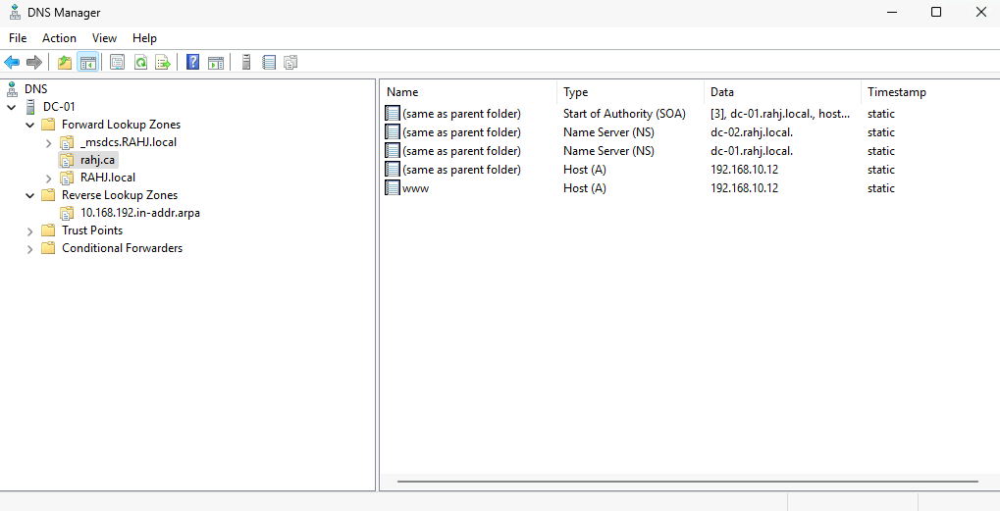

# DNS, DHCP, and Web Server Configuration

**Domain:** RAHJ.local  
**Author:** Aaron Queskekapow
**Date Created:** 2025-04-09  
**Last Updated:** 2025-04-12  
**Version:** 1.2  

---

## Change Log

| Date       | Version | Description                         |
|------------|---------|-------------------------------------|
| 2025-04-09 | 1.0     | Initial setup and documentation     |
| 2025-04-11 | 1.1     | Finalized DHCP and Web configuration|
| 2025-04-12 | 1.2     | Added service redundancy and backup |

---

## DNS, DHCP, and Web Server Configuration – RAHJ High School

This document outlines the implementation of DNS, DHCP, and Web Server services at RAHJ High School, using Windows Server 2025 and Ubuntu-based LAMP stack technologies. All configurations were performed on internal domain-joined infrastructure and aligned with best practices for availability, fault tolerance, and service redundancy.

---

## DNS Server/Service Configuration

### Global DNS – `rahj.ca`

The global DNS setup ensures public access to the school website from anywhere using the domain `rahj.ca`.

- **DNS Zone:** `rahj.ca` created on DC-01
- **A Records:**
  - `@` ➝ `192.168.10.12` (internal IP for web server)
  - `www` ➝ `192.168.10.12`
- **NS Records:**
  - `dc-01.rahj.local`
  - `dc-02.rahj.local`

These entries are statically assigned and published through GoDaddy to map the public IP address via NAT.

---

### Local DNS – `RAHJ.local`

The local DNS supports Active Directory, local resource resolution, and PTR record mapping.

- **Forward Lookup Zone:** `RAHJ.local`
  - A records for:
    - `DC-01` ➝ `192.168.10.10`
    - `DC-02` ➝ `192.168.10.13`
    - `FS-01` ➝ `192.168.10.11`
    - Workstations ➝ `192.168.x.x`
- **NS Records:** Redundant DNS via both DC-01 and DC-02

📷 *Insert Screenshot Here:* `DNS - Local - RAHJ local.png`

- **Reverse Lookup Zone:** `192.168.10.x`
  - PTR records exist for all key hosts

📷 *Insert Screenshot Here:* `DNS - Reverse Lookup.png`

---

## DHCP Server/Service Configuration

### DHCP Server

Two DHCP servers were configured for high availability:

- **Primary:** DC-01 (192.168.10.10)
- **Secondary:** DC-02 (192.168.10.13)
- **Failover Mode:** Load Balance (50/50)
- **DHCP Role Installed & Authorized** on both servers

📷 *Insert Screenshot Here:* `DC-01-DHCP-DNS.png`  
📷 *Insert Screenshot Here:* `DC-02-DHCP-DNS.png`

---

### DHCP Scopes / Pools

Each VLAN has its own dedicated scope with a reserved IP range and proper lease settings:

| VLAN       | Scope ID         | Start IP       | End IP         | Lease Time  |
|------------|------------------|----------------|----------------|-------------|
| Staff      | 192.168.30.0/24  | 192.168.30.50  | 192.168.30.69  | 3 days      |
| Students   | 192.168.40.0/24  | 192.168.40.50  | 192.168.40.129 | 2 hours     |
| Classroom  | 192.168.50.0/24  | 192.168.50.50  | 192.168.50.57  | 3 days      |
| Library    | 192.168.60.0/24  | 192.168.60.50  | 192.168.60.55  | 3 days      |
| Lab        | 192.168.70.0/24  | 192.168.70.50  | 192.168.70.69  | 3 days      |

**DHCP Options:**
- Option 003 (Router): VLAN default gateway
- Option 006 (DNS): 192.168.10.10, 192.168.10.13

---

## Web Applications – School Website

The school website is hosted internally but is accessible globally via HTTPS using a custom domain and SSL.

- **Domain:** `rahj.ca` (and `www.rahj.ca`)
- **Server:** Ubuntu 24.04 (Apache2 on LAMP stack)
- **Internal IP:** 192.168.10.12
- **Public IP:** NAT from Capstone subnet to Ubuntu server
- **SSL:** Secured
- **Clean URLs:** https://www.rahj.ca > https://www.rahj.ca/staff

**Site navigation includes:**
- Home
- About
- News
- Staff
- Contact

---

## Service Redundancy and Backup

To ensure continued operations in the event of failure, both service-level and backup strategies were implemented.

### DHCP Redundancy
- **Failover relationship** between DC-01 and DC-02
- **Mode:** Load Balance (50% split)
- Ensures continued DHCP operation even if one server fails

### DNS Redundancy
- Both DC-01 and DC-02 act as authoritative name servers
- All DHCP scopes include both as DNS servers (Option 006)

### Domain Controller Backup
- **DC-01** is backed up to file server **FS-01**
- Backup path: `\\FS-01\Backup`
- Access restricted to **IT Department only**
- Enables full recovery in case of domain controller failure
